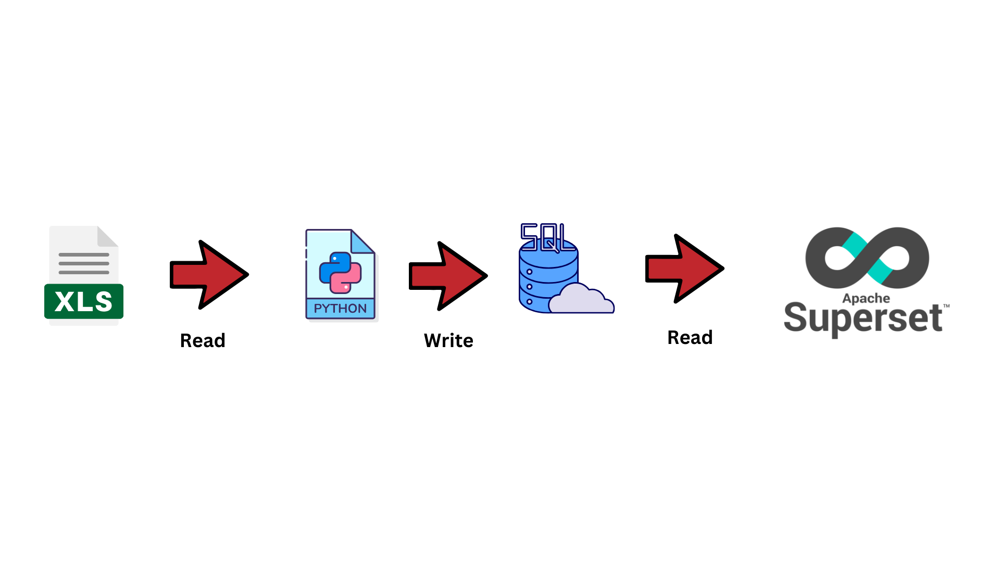
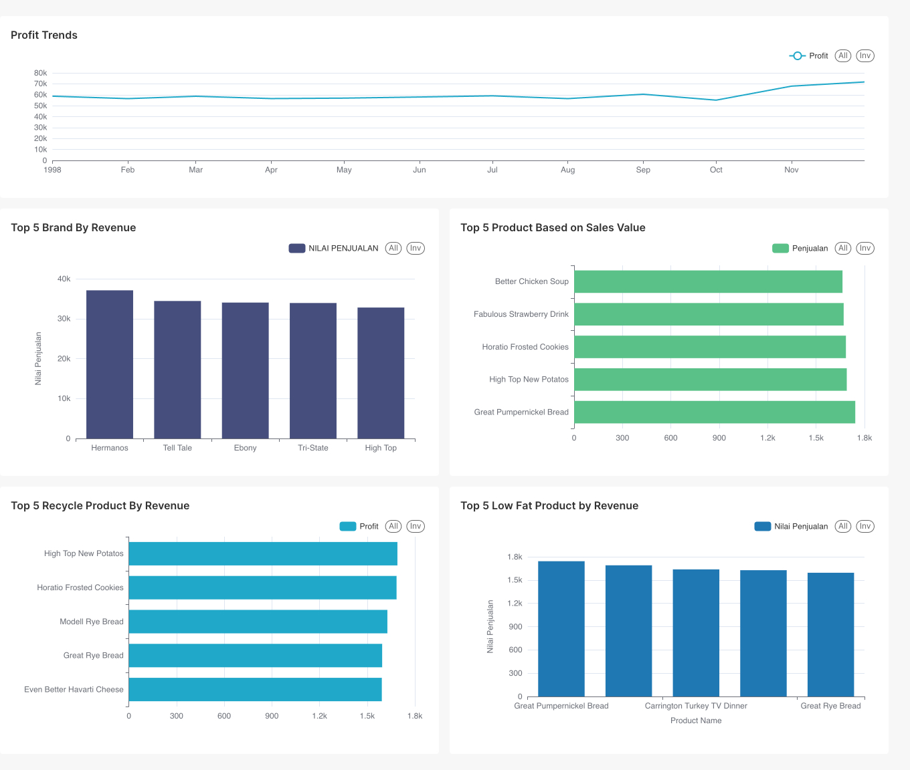

# Authentication List

## Superset :

**Username** : arsenoferi

**Password** : admin354

## Jupyter Notebook :

**Token** : arfeal

## Postgress (Database) :

**POSTGRES_USER**: root

**POSTGRES_PASSWORD**: example

**POSTGRES_DB**: mydb

## PGadmin :

**Username** : admin@example.com

**Password** : admin

# How to used this repo :
1. Install Docker (https://docs.docker.com/engine/install/)
2. Open docker application
3. Open terminal in current directory
4. put command : docker-compose up -d
5. open : http://localhost:3000/ in your browser

# Services that we used to created this project :

### This project used docker with 4 services :
1. Jupyter Notebook -> Create ETL from excel file to Database
2. Pgadmin -> Manage postgress
3. Postgress -> Our Database
4. Superset -> Our BI Tools

# Dashboard Explanation

## Transaction Overview

We can conclude the sales value of this store group mostly stable but there is significant growth on October this is probably because the effect of Halloween. We can conclude also if you want to win make sure your product is low fat this indicate by great pumpkin bread had most product sales in this store group. great pumpkin bread is low fat product

